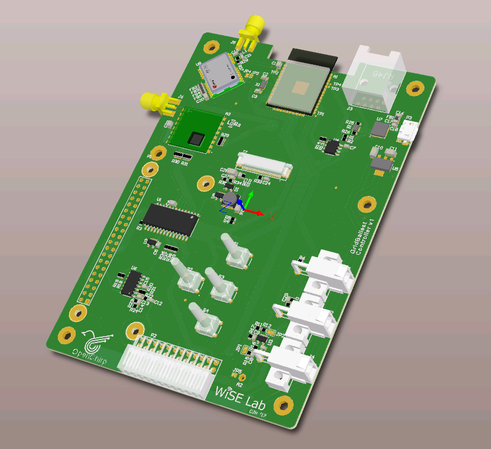
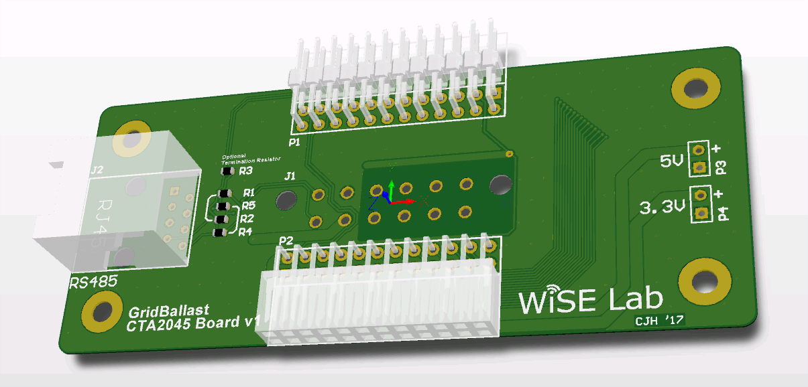

# GridBallast
Open Source Water Heater and Plug Load Controller

## Controller Board
This is the main board that interfaces with the peripherals.
The board integrate the following modules and features:
* ESP32
* U-Blox NEO-M8T GPS Timing Chip
* SX1276 Radio
* USB programming and debugging
* 2.4" OLED display
* 4 way navigation buttons
* Raspberry Pi connectivity
* 60Hz Frequency Monitor
* RS485 and I2C exposed interfaces
* 2000:1 current transformer input
* Amplified microphone input with phantom power
* Leak detector input

## Relay, CT, and Temp Board
This is the accessory board that has two onboard high-power relays, a current transformer, and two analog inputs for temperature sensors.

## CTA2045 and RS485 Board
This small accessory board holds the connector to support CTA2045 and other RS485 communications.

